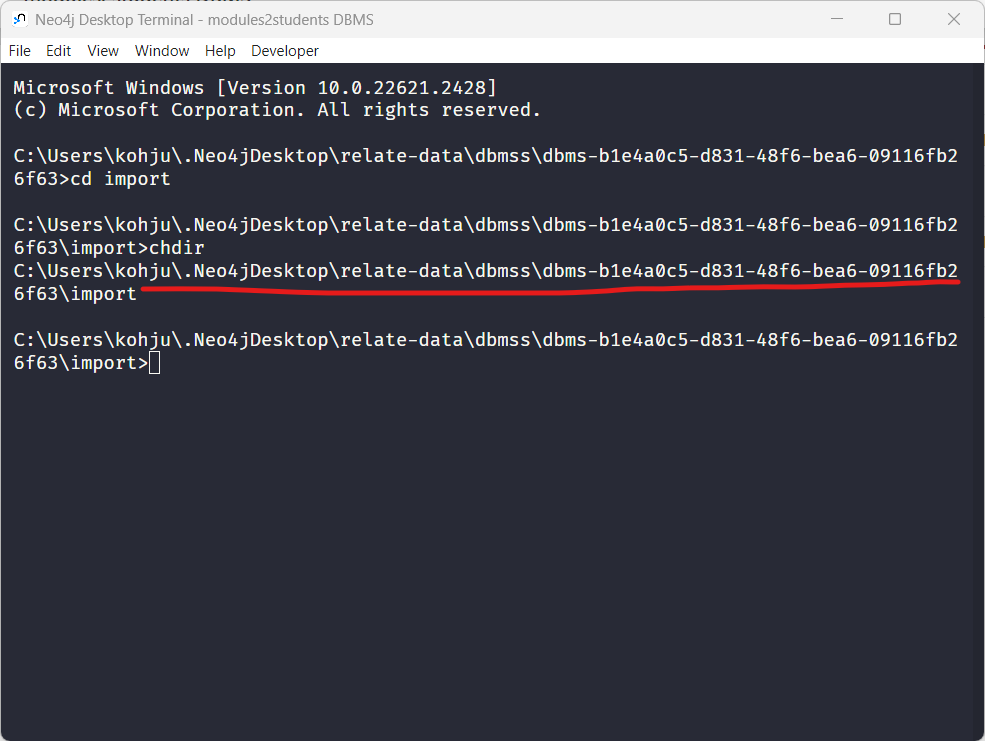

# modules2students Set Up Guide

## Introduction

There are two ways to set up modules2students and run it locally.

The first method is the manual setup which involves downloading all software needed manually while the second method
uses Docker to pull in the necessary images. The following steps have been tested and carried out on a 64-bit Intel Windows PC 
running Windows 11. 

## Manual Installation

### Clone this repo

Please clone this repo to your desired location

### Software Dependencies

Install the following programming languages, runtime and software.

#### Git for Windows v2.42.0.windows.2
1. Download Git for Windows v2.42.0.windows.2 from [here](https://github.com/git-for-windows/git/releases/download/v2.42.0.windows.2/Git-2.42.0.2-64-bit.exe)
2. Execute the installer
3. Check that it is correctly installed by running `git --version` in a shell application like PowerShell

#### Python 3.9.13
1. Download Python 3.9.13 from [here](https://www.python.org/ftp/python/3.9.13/python-3.9.13-amd64.exe)
2. Execute the installer
3. Check that it is correctly installed by running `python --version` in a shell application like PowerShell

#### Java SE Development Kit 19.0.2
1. Download Java SE Development Kit 19 from [here](https://download.oracle.com/java/19/archive/jdk-19.0.2_windows-x64_bin.exe)
2. Execute the installer
3. Check that it is correctly installed by running `java --version` in a shell application like PowerShell

#### Intellij Community Education 2023.2.3
1. Download Intellij Community Education from [here](https://download.jetbrains.com/idea/ideaIC-2023.2.3.exe)
2. Execute the installer
3. Check that it is correctly installed by starting a new Java project
    - Make sure the Java SDK selected is the one installed previously i.e. 19.0.2
    - Compile and make sure it can run successfully

#### Neo4j Desktop 1.5.9
1. Go [here](https://neo4j.com/deployment-center/#desktop) select Windows and download Neo4j Desktop 1.5.9
2. Execute the installer

### Setting up the graph database in Neo4j
1. Open Neo4j Desktop and create a new DBMS. Give it a name and password and select the version to be 5.8.0.
   
2. Start up the DBMS after creation and install both the APOC and Graph Data Science Library plugins.
   
   
3. Open the neo4j database in the DBMS in Neo4j Browser
   

### Import data into the graph database

To import the required data into the database, we will make use of Cypher queries. 
But first, the required CSV files must be placed in a file location accessible by the database.

To find the location, from the Open dropdown menu of your active Neo4j DBMS, select Terminal, and run `cd import`.
The current working directory is the place where the CSV files should be placed.



Open up the import directory and copy `all_modules_with_encodings.csv`, `mutually_exclusive.csv` and 
`prerequisite_groups.csv` inside. These files can be found in `modules2Students/scraping-scripts/scraped-data/`.


### Import data into the database
1. Run the query `CREATE CONSTRAINT UniqueModule FOR (m:Module) REQUIRE m.course_code IS UNIQUE` to create a unique
constraint on the module code
2. Load the `all_modules_with_encodings.csv` file into the database
   ```
   LOAD CSV WITH HEADERS FROM 'file:///all_modules_with_encodings.csv' AS row
   WITH row['Faculty'] AS faculty, row['BDE'] AS bde, row['Topics'] AS topics, row['Academic Units'] AS academic_units, row['Course Code'] AS course_code, row['Course Information'] AS course_info, row['Encoded Course Name'] AS encoded_course_name, row['Course Name'] AS course_name, row['Grade Type'] AS grade_type, row['Encoded Course Information'] AS encoded_course_info
   MERGE (m:Module {course_code: course_code })
   SET m.course_name = course_name
   SET m.academic_units = toInteger(trim(academic_units))
   SET m.faculty = faculty
   SET m.broadening_and_deepening = toLower(trim(bde)) IN ['1','true','yes']
   SET m.grade_type = grade_type
   SET m.course_info = course_info
   SET m.topics = topics
   SET m.encoded_course_info = encoded_course_info
   SET m.encoded_course_name = encoded_course_name
   ```
3. Load the `mutually_exclusive.csv` file into the database
   ```
   LOAD CSV WITH HEADERS FROM 'file:///mutually_exclusive.csv' AS row
   WITH row['mutually_exclusive'] AS mutually_exclusive, row['course_code'] AS course_code
   MATCH (source:Module { course_code: course_code })
   MATCH (target:Module { course_code: mutually_exclusive })
   MERGE (source)-[r: MUTUALLY_EXCLUSIVE]->(target);
   ```
4. Create a unique constraint on the prerequisite group id
   ```
   CREATE CONSTRAINT UniquePrerequisiteGroup FOR (p:PrerequisiteGroup) REQUIRE p.group_id IS UNIQUE
   ```
5. Load the `prerequisite_groups.csv` file into the database
   ```
   LOAD CSV WITH HEADERS FROM 'file:///prerequisite_groups.csv' AS row
   WITH row['prerequisites'] AS prerequisites, row['course_code'] AS course_code, row['group_id'] AS group_id
   MERGE (p:PrerequisiteGroup {group_id: group_id })
   SET p.prerequisites = prerequisites
   ```
6. Connect prerequisite groups to their target modules i.e. the modules for which the prerequisite groups contain their
prerequisites
   ```
   LOAD CSV WITH HEADERS FROM 'file:///prerequisite_groups.csv' AS row
   WITH row['prerequisites'] AS prerequisites, row['course_code'] AS course_code, row['group_id'] AS group_id
   MATCH (source: PrerequisiteGroup {group_id: group_id })
   MATCH (target: Module { course_code: course_code })
   MERGE (source)-[r: ARE_PREREQUISITES]->(target);
   ```
7. Split the prerequisites in each prerequisite group
   ```
   MATCH (p:PrerequisiteGroup)
   SET p.prerequisites = split(coalesce(p.prerequisites,""), "|")
   ```
8. Connect each module to their prerequisite groups
   ```
   MATCH (p:PrerequisiteGroup)
   UNWIND p.prerequisites AS prereq
   WITH p, prereq
   MATCH (m:Module {course_code: prereq})
   MERGE (m)-[:INSIDE]->(p)
   ```
9. Split each module encoded course information
   ```
   MATCH (m:Module) 
   SET m.encoded_course_info = split(coalesce(m.encoded_course_info,""), "|")
   SET m.encoded_course_info = [x IN m.encoded_course_info | toFloat(x)]
   ```
10. Split each module encoded course name
   ```
   MATCH (m:Module) 
   SET m.encoded_course_name = split(coalesce(m.encoded_course_name,""), "|")
   SET m.encoded_course_name = [x IN m.encoded_course_name | toFloat(x)]
   ```


## Data Collection and Preparation

This section contains instructions on how to collect and prepare the data of NTU's modules data.
You can skip this section if you are not planning to collect and prepare the data. The required data has
already been collected and are stored in `modules-recommender/scraping-scripts/scraped-data`

#### Data Collection and Preparation Steps

1. Change directory to `modules-recommender/scraping-scripts/` and create a Python virtual environment
using the command `python -m venv env`
2. Activate the python virtual environment using the command `env/Scripts/Activate.ps1`
3. Install the necessary packages using `pip install -r requirements.txt`
4. Start up jupyter notebook using `jupyter notebook`
5. Run all scripts in `Scraping_NTU_Content_Of_Courses.ipynb` (this will likely take 4-5 hours minimum)
6. Run all scripts in `Merging_Data.ipynb`
7. Run all scripts in `Encoding_Information.ipynb` (this will likely take around 15 minutes to complete)
8. The final files that we require are `all_modules_with_encodings.csv`, `prerequisite_groups.csv`, `mutually_exclusive.csv`.
The rest of the intermediary files can be discarded.
